#  **WhatsApp Cloud API — Developer’s Roadmap (Complete Guide)**

*A step-by-step practical guide to understanding and building with Meta’s WhatsApp Cloud API.*

---

##  Table of Contents

1. [Introduction to WhatsApp Cloud API](#1-introduction-to-whatsapp-cloud-api)
2. [Setting Up a Meta Developer Account](#2-setting-up-a-meta-developer-account)
3. [Creating a WhatsApp App in Meta Dashboard](#3-creating-a-whatsapp-app-in-meta-dashboard)
4. [Getting Started with Access Tokens & Phone Numbers](#4-getting-started-with-access-tokens--phone-numbers)
5. [Sending Your First Message (Graph API + cURL)](#5-sending-your-first-message-graph-api--curl)
6. [Understanding Templates, Media, and Interactive Messages](#6-understanding-templates-media-and-interactive-messages)
7. [Managing Webhooks for Message Delivery & Status Updates](#7-managing-webhooks-for-message-delivery--status-updates)
8. [Using Postman Collection for WhatsApp Cloud API](#8-using-postman-collection-for-whatsapp-cloud-api)
9. [Building a Real App with Node.js + Express + WhatsApp Cloud API](#9-building-a-real-app-with-nodejs--express--whatsapp-cloud-api)
10. [Common Errors, Debugging, and Best Practices](#10-common-errors-debugging-and-best-practices)
11. [Monetization Ideas & Real-World Use Cases](#11-monetization-ideas--real-world-use-cases)
12. [Next Steps: Going Beyond Cloud API (Flows, Embedded Signup, etc.)](#12-next-steps-going-beyond-cloud-api-flows-embedded-signup-etc)
13. [Bonus: Auto-Updating Developer FAQ](#13-bonus-auto-updating-developer-faq)

---

## 1. **Introduction to WhatsApp Cloud API**

###  What is the WhatsApp Cloud API

Explain the concept and Meta’s cloud-hosted infrastructure.

###  Difference between On-Premises vs Cloud API

Key differences in hosting, setup, and maintenance.

###  Why Businesses and Developers Prefer Cloud API

Simplified setup, no server costs, instant updates.

###  Overview of Graph API Integration

How Cloud API uses Meta’s Graph API structure.

---

## 2. **Setting Up a Meta Developer Account**

###  Creating a Meta Developer Account

Step-by-step sign-up and configuration.

###  Enabling Developer Mode

How to activate developer mode in Meta.

###  Setting up a “Business App”

Choosing the correct product (WhatsApp).

###  Understanding Dashboard, Permissions, and App Review

Basic dashboard navigation and approval flow.

---

## 3. **Creating a WhatsApp App in Meta Dashboard**

###  Steps to Add WhatsApp Product

How to connect WhatsApp to your Meta App.

###  Linking Your Meta Business Account

Setting up proper business account connections.

###  Test Number vs Permanent Number

Difference, purpose, and upgrade process.

###  Accessing WhatsApp Manager

Navigating to WhatsApp Manager and overview.

---

## 4. **Getting Started with Access Tokens & Phone Numbers**

###  Generating a Temporary Access Token

Where and how to get it.

###  Why You Need a Permanent Token

Explanation and use cases.

###  Setting Up System User & Access Token in Meta Business Manager

Permanent access setup guide.

###  Connecting Your Business Phone Number

Registration and verification.

---

## 5. **Sending Your First Message (Graph API + cURL)**

###  Using `curl` to Send a Message

Full example with endpoint and JSON body.

###  Understanding the `/messages` Endpoint

Breaking down required fields and headers.  

###  Sending Text, Image, and Template Messages

Different message formats and code samples.

###  Checking Message Delivery Status

How to verify if messages were sent successfully.

---

## 6. **Understanding Templates, Media, and Interactive Messages**

###  What Are Message Templates

Purpose and usage.

###  Uploading and Sending Media

How to send images, audio, and documents.

###  Using Interactive Buttons and Lists

Examples of user-friendly WhatsApp experiences.

###  Real Use Case Examples

Customer support, notifications, and marketing.

---

## 7. **Managing Webhooks for Message Delivery & Status Updates**

###  What Are Webhooks

Concept and purpose.

###  Setting Up a Webhook URL

Configuration via Meta Dashboard.

###  Verifying Webhook Endpoint

Token verification and testing.

###  Handling Incoming Messages with Node.js

Webhook listener example (Express.js).

---

## 8. **Using Postman Collection for WhatsApp Cloud API**

###  Introduction to Official Postman Collection

Purpose and how to import it.

###  Sending Requests via Postman

Testing API endpoints quickly.

###  Using Environment Variables

Organizing tokens and phone IDs in Postman.

###  Troubleshooting and Logs

Debugging failed requests.

---

## 9. **Building a Real App with Node.js + Express + WhatsApp Cloud API**

###  Project Setup (with TypeScript Optional)

Folder structure and dependencies.

###  Sending Messages from Backend

Practical API route code.

###  Setting Up Webhook Listener Endpoint

Receive & respond to messages.

###  Building a Simple Frontend Dashboard

React or HTML interface for sending messages.

###  Deployment Tips

How to host on Render, Railway, or Vercel.

---

## 10. **Common Errors, Debugging, and Best Practices**

###  Common Graph API Errors

List + explanation of frequent issues.

###  Token Expiry and Permissions

Fixes for access-related problems.

###  Scaling and Reliability

Optimizing performance.

###  Security Best Practices

Protecting tokens and data.

---

## 11. **Monetization Ideas & Real-World Use Cases**

###  SaaS Tools

Build dashboards or message senders.

###  Automation Bots

Create business workflow bots.

###  CRM / eCommerce Integration

Automate order updates or support.

###  Consulting and Freelance Services

Offer API setup as a service.

---

## 12. **Next Steps: Going Beyond Cloud API**

###  What Are WhatsApp Flows

Intro to flow-based automation.

###  Embedded Signup

Simplifying onboarding for clients.

###  Advanced Graph API Features

Multi-business integrations.

###  Preparing for API Updates

Keeping up with Meta releases.

---

## 13. **Bonus: Auto-Updating Developer FAQ**

This FAQ auto-refreshes weekly from Meta’s official WhatsApp Cloud API documentation — summarized for developers.

**Live Sources:**

* [Meta Developer FAQ](https://developers.facebook.com/support/faq/)
* [Meta Developer Community](https://developers.facebook.com/community/)
* [Reddit — WhatsApp Business API](https://www.reddit.com/r/WhatsappBusinessAPI/)
* [Stack Overflow — WhatsApp Cloud API](https://stackoverflow.com/questions/tagged/whatsapp-cloud-api)

---

##  License & Credits

This guide is written independently and references Meta documentation for educational purposes.
Always check official Meta Docs for the most recent API updates.

---

#  Chapter 1 — Introduction to WhatsApp Cloud API

Welcome to the **developer’s ultimate guide** for WhatsApp Cloud API — built for engineers who want to *understand, build, and ship* WhatsApp-powered apps fast.

This chapter gives you a full understanding of:
- What the WhatsApp Cloud API actually is  
- Why it exists (and why you should use it instead of the on-premises version)  
- How it connects to the **Meta Graph API**  
- Real developer examples  
- and what you’ll be building in this guide

---

##  What is the WhatsApp Cloud API?

The **WhatsApp Cloud API** is Meta’s official **RESTful API** that allows developers and businesses to send and receive WhatsApp messages **without maintaining any servers**.

Think of it as:
> “A globally hosted WhatsApp Business Server — managed by Meta — that you can access using HTTPS and tokens.”

**You can:**
- Send text, image, video, and document messages
- Receive incoming messages in real time
- Build automation bots (customer support, order updates, etc.)
- Integrate WhatsApp with your CRM, eCommerce store, or app

**You can’t (yet):**
- Use it for mass marketing (Meta reviews templates)
- Access messages from personal WhatsApp accounts

---

##  Why Meta Created the Cloud API

Before the Cloud API, developers had to **host an On-Premises WhatsApp Business API client** — which was:
- Heavy (~10 GB Docker images)
- Hard to update
- Dependent on specific OS and network setups

Meta realized this limited adoption, so in 2022 they launched:
> **WhatsApp Cloud API — a managed, globally available version hosted on Meta’s servers.**

This gives developers instant access through the same Meta infrastructure used by **Instagram Graph API** and **Facebook Graph API**.

---

##  How It Works (High-Level Architecture)

Let’s break it down visually 


*Figure 1: Cloud API overview*

**Flow Summary:**
1. Your app sends an HTTPS request to the Graph API endpoint.
2. Meta’s Cloud API routes that to the WhatsApp network.
3. The message reaches the recipient instantly.
4. Delivery and read events come back to your app through **webhooks**.

---

###  Example Flow — Sending a Message

To send a message, you make a `POST` request to the Graph API like this:

```bash
curl -i -X POST `
  https://graph.facebook.com/v21.0/PHONE_NUMBER_ID/messages `
  -H 'Authorization: Bearer ACCESS_TOKEN' `
  -H 'Content-Type: application/json' `
  -d '{
    "messaging_product": "whatsapp",
    "to": "PHONE_NUMBER",
    "type": "text",
    "text": { "body": "Hello from Cloud API " }
  }'
````

 That’s it — no Docker containers, no installation, just an HTTPS request.

---

##  On-Premises API vs Cloud API

| Feature     | On-Premises API                   | Cloud API            |
| ----------- | --------------------------------- | -------------------- |
| Hosting     | Self-hosted on your servers       | Managed by Meta      |
| Setup       | Docker + database + system config | Ready instantly      |
| Maintenance | Manual updates                    | Auto updates         |
| Scaling     | Limited by server                 | Scales automatically |
| Security    | Your responsibility               | Handled by Meta      |
| Ideal for   | Enterprises needing full control  | Developers & SMBs    |

>  **Tip:** Unless you’re building for enterprise clients with strict compliance needs, start directly with the **Cloud API** — it’s modern, reliable, and dev-friendly.

---

##  Relationship with Graph API

The WhatsApp Cloud API is **a branch of Meta’s Graph API** — it uses the same Graph versioning system (`v21.0`, `v20.0`, etc.) and the same token-based access.

That means if you’ve used:

* **Instagram Graph API**
* **Facebook Page API**
* **Messenger Platform**

… you’ll feel right at home. The authentication, permission model, and request structure are identical.

**Graph API endpoint example:**

```
POST https://graph.facebook.com/v21.0/{Phone-Number-ID}/messages
```

**Why that’s awesome for developers:**

* Reuse your existing Graph API experience
* Centralized token management in Meta Developer Dashboard
* Unified logging and monitoring

---

##  Core Components You’ll Work With

Here are the key terms that will appear throughout this guide:

| Term                        | Description                                                     |
| --------------------------- | --------------------------------------------------------------- |
| **Business Account (WABA)** | Your registered WhatsApp Business Account.                      |
| **Phone Number ID**         | Unique ID assigned to your phone number in Meta.                |
| **Access Token**            | Used for authentication; can be temporary or permanent.         |
| **Webhook**                 | Your endpoint that receives message updates & delivery reports. |
| **Message Template**        | Pre-approved messages for notifications or marketing.           |

Each one will have its own section later — with visuals, API examples, and setup tutorials.

---

##  Real Developer Example — Why It Matters

Let’s take a real use case 

Imagine you built a **Node.js eCommerce backend**.
You can integrate WhatsApp Cloud API to:

* Automatically send order confirmation
* Share shipping status updates
* Handle user queries using chatbots

So your flow looks like this:

```
Customer places order → Backend triggers Cloud API → Customer gets WhatsApp message
```

You can even handle replies via webhooks to make it two-way.
No third-party tools. No middlemen.

---

##  Developer Advantages (Summed Up)

| Advantage                | Why It Matters                         |
| ------------------------ | -------------------------------------- |
| **Fast to Integrate**    | Just need HTTPS + token                |
| **Reliable**             | Hosted by Meta’s infra                 |
| **Secure**               | Token-based auth                       |
| **Multi-format Support** | Send text, media, interactive          |
| **Scalable**             | Same backend used by WhatsApp globally |

>  The Cloud API is not just a developer tool — it’s a **foundation** for building WhatsApp-powered SaaS, automation tools, or custom integrations.

---

##  Summary

**You now know:**

* What the WhatsApp Cloud API is and why it exists
* How it differs from the old On-Premises API
* How it fits into Meta’s Graph API ecosystem
* The key terms (Access Token, Webhook, Phone Number ID)
* Why developers love using it

>  **Next Chapter:** Let’s set up your Meta Developer Account and get your first access token.
>
> You’ll go from zero → working API call in under 10 minutes.

---

##  Step 1: Create a Meta Developer Account

1. Go to the [Meta for Developers](https://developers.facebook.com/) website.
2. Click **Get Started** (top-right corner).
3. Log in with your **personal Facebook account**.
4. Follow the prompts to accept the **Developer Terms**.
5. Once completed, you’ll see your **Developer Dashboard**.


*Figure 1: Meta Developer Dashboard after signup*

>  **Tip:** Use a Facebook account tied to your business email to avoid future access issues.

---

##  Step 2: Enable Developer Mode (If Not Already)

Developer mode allows you to create apps and generate access tokens. Usually, new accounts have it enabled automatically.

1. Click your profile → **Settings** → **Developer Settings**.
2. Check that **Developer Mode** is active.
3. If not, click **Enable Developer Mode**.

>  This step ensures your account can create apps and manage WhatsApp products.

---

##  Step 3: Create a Business App

1. Go to **My Apps** → Click **Create App**.
2. Select **Business** as the app type.
   - Options:
     - Consumer
     - Business → select this
3. Give your app a **name**, add your **contact email**, and select a **Business Manager account** (optional but recommended).
4. Click **Create App**.
5. Complete the security check (CAPTCHA) if prompted.


*Figure 2: Creating a new Business App in Meta Dashboard*

>  **Pro Tip:** The app name can be anything — but for production apps, use your brand or project name for clarity.

---

##  Step 4: Add WhatsApp Product

1. In your new app’s dashboard, click **Add Product** → select **WhatsApp** → click **Set Up**.
2. You’ll be taken to the WhatsApp product setup screen.
3. Key components here:
   - **Test Phone Number:** For initial API testing
   - **Phone Number ID:** Unique identifier for sending messages
   - **Business Account:** Connect your Meta Business account (required for production)


*Figure 3: Add WhatsApp product to your app*

---

##  Step 5: Understanding the Dashboard

Your **Meta App Dashboard** has key sections:

| Section | Purpose |
|---------|---------|
| **App ID / App Secret** | Credentials for API calls (keep secret) |
| **Access Tokens** | Needed to authenticate API requests |
| **Products** | WhatsApp, Messenger, Instagram API management |
| **Roles** | Assign users, admins, or system users |
| **Webhooks** | Setup endpoints for receiving messages and status updates |

>  **Tip:** Bookmark your dashboard — you’ll reference App ID, Phone Number ID, and Tokens multiple times.

---

##  Step 6: Set Up Business Manager (Optional but Recommended)

1. Go to [Meta Business Manager](https://business.facebook.com/).
2. Create a business account if you don’t have one.
3. Connect your **Meta App** to this Business Manager account.
4. Add **system users** who will manage tokens and API access.

>  This ensures your API setup is **scalable and secure**, especially for production.

---

##  Step 7: Summary & Next Steps

After completing these steps, you now have:
-  A Meta Developer account
-  Developer mode enabled
-  A Business App created
-  WhatsApp product added to the app
-  (Optional) Business Manager connected for scaling

>  **Next Chapter:** Creating a WhatsApp App in Meta Dashboard — we’ll explore **Test Numbers vs Permanent Numbers**, linking your business account, and preparing for your **first API message**.


#  Chapter 3 — Creating a WhatsApp App in Meta Dashboard

Now that you have your **Meta Developer account** and a **Business App**, it’s time to **create and configure your WhatsApp App**. This chapter covers everything from **linking your business account**, setting up **test numbers**, and preparing your app for sending messages.

---

##  Step 1: Access Your Business App

1. Go to [Meta for Developers](https://developers.facebook.com/) → **My Apps**.
2. Click on your previously created **Business App**.
3. You’ll see the **App Dashboard** with all your products listed.


*Figure 1: Meta Developer App Dashboard*

---

##  Step 2: Add WhatsApp Product (If Not Already Added)

1. Inside your app, navigate to **Add Product** → select **WhatsApp** → click **Set Up**.
2. You’ll see **WhatsApp Cloud API** options:
   - **Test Number** — temporary number for API testing
   - **Phone Number ID** — unique identifier
   - **Business Manager** — optional but recommended for production

>  **Pro Tip:** Always start with a **test number** to avoid spamming real users.

---

##  Step 3: Understanding Test Numbers vs Permanent Numbers

| Feature | Test Number | Permanent Number |
|---------|------------|----------------|
| **Purpose** | API testing & sandbox | Real production messages |
| **Limitations** | Only send messages to approved numbers | Send to any user |
| **Access** | Automatically generated by Meta | Requires business verification |
| **Expiration** | Temporary (can refresh) | Permanent (long-lived) |

>  **Tip:** Begin with a **Test Number** until you fully understand the API flow. Once ready, request a **Permanent Number** via your Business Manager.

---

##  Step 4: Linking Your Meta Business Account

1. Go to **Business Settings** in Meta Business Manager.
2. Under **Accounts → WhatsApp Accounts**, click **Add**.
3. Select your newly created **WhatsApp App**.
4. Verify ownership and link your **phone number**.


*Figure 2: Linking Business Account to WhatsApp App*

>  Linking ensures your messages are sent under your **official business identity**.

---

##  Step 5: Accessing WhatsApp Manager

WhatsApp Manager is where you **manage phone numbers, templates, and webhooks**.

1. Inside your Business App dashboard, click **WhatsApp → Go to WhatsApp Manager**.
2. Key sections:
   - **Phone Numbers**: view and manage test/permanent numbers
   - **Message Templates**: create or manage pre-approved templates
   - **Settings**: configure webhook URL and notifications


*Figure 3: WhatsApp Manager interface*

>  **Pro Tip:** Bookmark this page — you’ll come back here frequently while integrating the API.

---

##  Step 6: Generate Access Token for Test Number

1. Go to **WhatsApp → Settings → API Key / Token**.
2. Copy your **temporary access token**.
3. This token will authenticate your **first API requests**.

>  Tokens expire — for production, you’ll need a **long-lived token**.

---

##  Step 7: Summary & Next Steps

After completing these steps, you now have:

-  WhatsApp Product added to your app  
-  Test number ready for API experimentation  
-  Phone Number ID and Access Token generated  
-  Business Account linked for production use  

>  **Next Chapter:** Getting Started with Access Tokens & Phone Numbers — generating permanent tokens, system users, and preparing for real message sending.


---

`
#  Chapter 4 — Getting Started with Access Tokens & Phone Numbers (Deep Dive)

In this chapter, we go **under the hood** of WhatsApp Cloud API authentication and phone number management. These are **critical pieces** — without them, you can’t send or receive messages.  

We’ll cover:

- Types of access tokens: temporary vs long-lived  
- How to securely generate and store tokens  
- Phone Number IDs and their purpose  
- Connecting test vs permanent numbers  
- Best practices for token & phone number management

---

##  Step 1: Understanding Access Tokens in Depth

Access tokens are **digital keys** that tell Meta:  
> "This app is authorized to send/receive WhatsApp messages on behalf of this business."

### Why Tokens Exist

- Authenticate API requests (security)  
- Identify the app and the business  
- Control permissions (read/write templates, send messages, manage webhooks)  

### Token Types

| Token Type | Duration | Purpose | Example Use Case |
|------------|----------|---------|-----------------|
| **Temporary Token** | ~24 hours | Quick testing | Send messages to test number while experimenting |
| **Permanent / Long-Lived Token** | 60 days+ | Production usage | Integrate WhatsApp into live customer support system |

> **Pro Tip:** Treat tokens like passwords. Never expose them publicly. Always use `.env` files or secret management systems.

---

##  Step 2: Generating a Temporary Access Token

1. Go to **Meta Developer Dashboard → WhatsApp → Settings → API Key / Token**.  
2. Click **Generate Token**. A temporary token appears.  

Example usage:

```bash
curl -X POST "https://graph.facebook.com/v21.0/PHONE_NUMBER_ID/messages" \
-H "Authorization: Bearer TEMP_ACCESS_TOKEN" \
-H "Content-Type: application/json" \
-d '{
      "messaging_product": "whatsapp",
      "to": "RECIPIENT_PHONE_NUMBER",
      "type": "text",
      "text": {"body": "Hello from WhatsApp Cloud API! "}
    }'
````

* This token is **short-lived** (~24 hours).
* Useful for testing API calls with **Test Numbers**.

>  **Common Pitfall:** Using a temporary token in production will fail after it expires.

---

##  Step 3: Setting Up Permanent / Long-Lived Tokens

For production, you need **long-lived tokens**:

1. Go to **Meta Business Manager → System Users**.
2. Click **Add System User** → Assign **Admin Access**.
3. Under **System User → Generate New Token**, select your WhatsApp App.
4. Copy the **Long-Lived Token** (60 days).

### Best Practices:

* Store tokens securely in `.env` files:

```env
WHATSAPP_TOKEN="YOUR_LONG_LIVED_TOKEN_HERE"
```

* Never commit tokens to version control.
* Rotate tokens every 60 days to maintain security.

>  **Pro Tip:** For automated systems, use **cron jobs** or scripts to refresh tokens before expiration.

---

##  Step 4: Understanding Phone Number IDs

Every phone number in WhatsApp Cloud API has a **Phone Number ID**. Why?

1. It uniquely identifies your number without exposing it publicly.
2. All API requests (sending messages, templates, media) require the **Phone Number ID**.
3. Test numbers come pre-generated. Permanent numbers require **verification**.

**Example API request structure:**

```bash
POST https://graph.facebook.com/v21.0/{PHONE_NUMBER_ID}/messages
```

>  Always use **Phone Number ID**, never the raw phone number.

---

##  Step 5: Connecting Your Business Phone Number

### Why This Matters

* Only verified business numbers can send messages in production.
* Ensures messages are **legally compliant** and **from a recognized business**.

### Steps:

1. Go to **WhatsApp Manager → Phone Numbers → Add Phone Number**.
2. Enter your **business number**.
3. Verify via **SMS or voice call**.
4. Once verified, you’ll get:

   * **Phone Number ID**
   * **Verified status**


*Figure 1: Adding & verifying a business phone number*

> **Pro Tip:** Start with a test number for sandbox experiments. Only add permanent numbers when ready for production.

---

##  Step 6: Security & Best Practices

1. **Environment Variables:**
   Always store tokens in `.env` files, e.g.,

   ```env
   WHATSAPP_LONG_TOKEN="your_long_lived_token"
   PHONE_NUMBER_ID="your_phone_number_id"
   ```
2. **Avoid Hardcoding:** Never include tokens in source code.
3. **Role Management:** Use **System Users** with limited permissions.
4. **Token Rotation:** Refresh long-lived tokens before expiration.
5. **Test vs Production:** Keep test numbers separate from production numbers to avoid accidental messaging.

---

##  Step 7: Real-World Developer Example

Imagine a Node.js eCommerce backend:

* **Goal:** Notify customers about order status via WhatsApp.
* **Steps:**

  1. Generate **long-lived token**.
  2. Connect your verified **business phone number**.
  3. Save token & Phone Number ID in environment variables.
  4. Send `POST` request to `/messages` endpoint whenever a new order is placed.
* **Benefits:**

  * Fully automated notifications
  * Two-way communication with webhooks
  * Scalable solution without hosting WhatsApp infrastructure

---

##  Step 8: Summary

After this chapter, you now have:

*  Deep understanding of **Access Tokens** (temporary & long-lived)
*  How to generate and securely store tokens
*  Understanding of **Phone Number IDs**
*  Test and/or permanent numbers connected and verified
*  Best practices for security, token rotation, and production setup

>  **Next Chapter:** Sending Your First Message (Graph API + cURL) — we’ll go **step-by-step from code to delivery**, including text, media, and template messages.


---

#  Chapter 5 — Sending Your First Message (Deep Dive, Pro-Level)

Now that your **access token** and **phone number** are ready, it’s time to send messages via WhatsApp Cloud API — but we’ll go **beyond basics**.  

We’ll cover:

- Text, media, template, and interactive messages  
- cURL, Node.js, and Python examples  
- Webhook integration for message status updates  
- Error handling & debugging  
- Advanced best practices for production  

---

##  Step 1: WhatsApp Cloud API Endpoint Explained

All messages are sent via:

```

POST [https://graph.facebook.com/v21.0/{PHONE_NUMBER_ID}/messages](https://graph.facebook.com/v21.0/{PHONE_NUMBER_ID}/messages)

````

### Required Headers:

```http
Authorization: Bearer YOUR_ACCESS_TOKEN
Content-Type: application/json
````

### Required Payload Fields

| Field                                                  | Description               | Notes                                                  |
| ------------------------------------------------------ | ------------------------- | ------------------------------------------------------ |
| `messaging_product`                                    | Must be `"whatsapp"`      | Required for all messages                              |
| `to`                                                   | Recipient phone number    | International format (`+<countrycode><number>`)        |
| `type`                                                 | Message type              | `text`, `image`, `document`, `template`, `interactive` |
| `text`, `image`, `document`, `template`, `interactive` | Payload depending on type | Detailed below                                         |

> **Pro Tip:** Always validate **Phone Number ID** and **recipient number format** before sending.

---

##  Step 2: Sending a Text Message

### cURL Example

```bash
curl -X POST "https://graph.facebook.com/v21.0/PHONE_NUMBER_ID/messages" \
-H "Authorization: Bearer YOUR_ACCESS_TOKEN" \
-H "Content-Type: application/json" \
-d '{
  "messaging_product": "whatsapp",
  "to": "RECIPIENT_PHONE_NUMBER",
  "type": "text",
  "text": { "body": "Hello!  This is my first WhatsApp message via Cloud API." }
}'
```

### Node.js Example (Axios)

```javascript
import axios from "axios";

const PHONE_NUMBER_ID = process.env.PHONE_NUMBER_ID;
const TOKEN = process.env.WHATSAPP_TOKEN;

const sendTextMessage = async () => {
  const data = {
    messaging_product: "whatsapp",
    to: "+1234567890",
    type: "text",
    text: { body: "Hello! " }
  };

  const response = await axios.post(
    `https://graph.facebook.com/v21.0/${PHONE_NUMBER_ID}/messages`,
    data,
    { headers: { Authorization: `Bearer ${TOKEN}`, "Content-Type": "application/json" } }
  );
  console.log(response.data);
};

sendTextMessage();
```

---

##  Step 3: Sending Media Messages

### Image Example

```bash
curl -X POST "https://graph.facebook.com/v21.0/PHONE_NUMBER_ID/messages" \
-H "Authorization: Bearer YOUR_ACCESS_TOKEN" \
-H "Content-Type: application/json" \
-d '{
  "messaging_product": "whatsapp",
  "to": "RECIPIENT_PHONE_NUMBER",
  "type": "image",
  "image": {"link": "https://example.com/image.jpg"}
}'
```

### Document Example

```bash
curl -X POST "https://graph.facebook.com/v21.0/PHONE_NUMBER_ID/messages" \
-H "Authorization: Bearer YOUR_ACCESS_TOKEN" \
-H "Content-Type: application/json" \
-d '{
  "messaging_product": "whatsapp",
  "to": "RECIPIENT_PHONE_NUMBER",
  "type": "document",
  "document": {"link": "https://example.com/file.pdf", "filename": "file.pdf"}
}'
```

>  Media URLs must be **public HTTPS URLs**. Otherwise, requests fail.

---

##  Step 4: Sending Template Messages

Templates are **pre-approved messages** for notifications.

```bash
curl -X POST "https://graph.facebook.com/v21.0/PHONE_NUMBER_ID/messages" \
-H "Authorization: Bearer YOUR_ACCESS_TOKEN" \
-H "Content-Type: application/json" \
-d '{
  "messaging_product": "whatsapp",
  "to": "RECIPIENT_PHONE_NUMBER",
  "type": "template",
  "template": {
    "name": "order_confirmation",
    "language": { "code": "en_US" },
    "components": [
      {
        "type": "body",
        "parameters": [
          { "type": "text", "text": "John" }
        ]
      }
    ]
  }
}'
```

>  Templates must be **approved in WhatsApp Manager** before production use.

---

##  Step 5: Sending Interactive Messages (Buttons, Lists)

### Example: Quick Reply Buttons

```bash
curl -X POST "https://graph.facebook.com/v21.0/PHONE_NUMBER_ID/messages" \
-H "Authorization: Bearer YOUR_ACCESS_TOKEN" \
-H "Content-Type: application/json" \
-d '{
  "messaging_product": "whatsapp",
  "to": "RECIPIENT_PHONE_NUMBER",
  "type": "interactive",
  "interactive": {
    "type": "button",
    "body": { "text": "Choose an option:" },
    "action": {
      "buttons": [
        { "type": "reply", "reply": { "id": "btn_1", "title": "Option 1" } },
        { "type": "reply", "reply": { "id": "btn_2", "title": "Option 2" } }
      ]
    }
  }
}'
```

> **Pro Tip:** Use interactive messages for **customer support flows** and **marketing campaigns**.

---

##  Step 6: Handling Webhook Events

WhatsApp sends webhook events for:

* Message received
* Message delivered
* Message read

### Example Webhook JSON

```json
{
  "object": "whatsapp_business_account",
  "entry": [
    {
      "id": "WHATSAPP_BUSINESS_ACCOUNT_ID",
      "changes": [
        {
          "value": {
            "messages": [
              {
                "from": "RECIPIENT_NUMBER",
                "id": "MESSAGE_ID",
                "timestamp": "TIMESTAMP",
                "text": { "body": "Hello!" },
                "type": "text"
              }
            ]
          },
          "field": "messages"
        }
      ]
    }
  ]
}
```

* Use **message IDs** to update your backend database
* Track **delivery & read status** in real-time

---

##  Step 7: Error Handling & Debugging

| Error  | Cause                  | Solution                             |
| ------ | ---------------------- | ------------------------------------ |
| 190    | Invalid/expired token  | Refresh token                        |
| 131043 | Template not approved  | Approve template in WhatsApp Manager |
| 131051 | Invalid phone number   | Use E.164 format (+countrycode)      |
| 232    | Media URL inaccessible | Ensure HTTPS public URL              |

>  **Pro Tip:** Always log **full API responses**. Include `message ID` for tracking.

---

##  Step 8: Full Message Flow Diagram

```
Customer Action → Backend Server → WhatsApp Cloud API → Recipient
                                     ↘ Webhook → Backend updates
```

* Flow covers **text, media, template, interactive messages**
* Webhooks ensure **status tracking and automation**

---

##  Step 9: Best Practices

1. Use **sandbox/test numbers** before production
2. Always **store tokens securely**
3. Monitor **API rate limits**
4. Log **message IDs** and **delivery status**
5. Separate **test vs production environments**
6. Rotate long-lived tokens every 60 days
7. Use **interactive messages** for higher engagement

---

`
#  Chapter 6 — Understanding Templates, Media, and Interactive Messages (Deep Dive)

Now that you can send messages, it’s time to **level up**.  
In this chapter, we’ll cover:

- WhatsApp **Message Templates** (pre-approved messages)  
- **Media messages**: images, documents, audio, video  
- **Interactive messages**: buttons, lists, reply options  
- **Real-world automation flows** for marketing and customer support  
- **Best practices** to increase deliverability and engagement

---

##  Step 1: WhatsApp Message Templates

Message templates are **pre-approved content** used for:

- Notifications: order confirmation, shipping updates  
- Alerts: appointment reminders, payment reminders  
- Customer engagement: surveys, follow-ups  

### Example JSON for Template Message

```bash
curl -X POST "https://graph.facebook.com/v21.0/PHONE_NUMBER_ID/messages" \
-H "Authorization: Bearer YOUR_ACCESS_TOKEN" \
-H "Content-Type: application/json" \
-d '{
  "messaging_product": "whatsapp",
  "to": "RECIPIENT_PHONE_NUMBER",
  "type": "template",
  "template": {
    "name": "appointment_reminder",
    "language": {"code": "en_US"},
    "components": [
      {"type": "body","parameters":[{"type":"text","text":"John"}]},
      {"type": "header","parameters":[{"type":"text","text":"Dentist Appointment"}]}
    ]
  }
}'
````

>  **Pro Tip:** Always include **placeholders** for dynamic data like names, dates, or amounts.

---

###  Template Types

| Type          | Use Case                        | Notes                        |
| ------------- | ------------------------------- | ---------------------------- |
| **Text Body** | Notifications & reminders       | Dynamic placeholders allowed |
| **Header**    | Optional: text, image, video    | Enhances visibility          |
| **Footer**    | Optional text                   | Add legal or additional info |
| **Buttons**   | Quick replies or call-to-action | Increases engagement         |

---

##  Step 2: Media Messages Deep Dive

WhatsApp Cloud API supports:

* **Image**
* **Document**
* **Audio**
* **Video**

### Example: Sending an Image with Caption

```bash
curl -X POST "https://graph.facebook.com/v21.0/PHONE_NUMBER_ID/messages" \
-H "Authorization: Bearer YOUR_ACCESS_TOKEN" \
-H "Content-Type: application/json" \
-d '{
  "messaging_product": "whatsapp",
  "to": "RECIPIENT_PHONE_NUMBER",
  "type": "image",
  "image": {
    "link": "https://example.com/product.jpg",
    "caption": "Check out our new product! "
  }
}'
```

### Key Notes:

* Media URLs must be **public HTTPS**
* Size limits: Image ≤ 5 MB, Video ≤ 16 MB
* For large campaigns, host media on a **CDN** for speed

---

##  Step 3: Interactive Messages

Interactive messages allow **user engagement directly in WhatsApp**.

### a) Quick Reply Buttons

```bash
curl -X POST "https://graph.facebook.com/v21.0/PHONE_NUMBER_ID/messages" \
-H "Authorization: Bearer YOUR_ACCESS_TOKEN" \
-H "Content-Type: application/json" \
-d '{
  "messaging_product": "whatsapp",
  "to": "RECIPIENT_PHONE_NUMBER",
  "type": "interactive",
  "interactive": {
    "type": "button",
    "body": {"text": "Choose an option:"},
    "action": {
      "buttons": [
        {"type":"reply","reply":{"id":"btn_1","title":"Option 1"}},
        {"type":"reply","reply":{"id":"btn_2","title":"Option 2"}}
      ]
    }
  }
}'
```

### b) List Messages

```bash
curl -X POST "https://graph.facebook.com/v21.0/PHONE_NUMBER_ID/messages" \
-H "Authorization: Bearer YOUR_ACCESS_TOKEN" \
-H "Content-Type: application/json" \
-d '{
  "messaging_product": "whatsapp",
  "to": "RECIPIENT_PHONE_NUMBER",
  "type": "interactive",
  "interactive": {
    "type": "list",
    "body": {"text": "Select a service:"},
    "action": {
      "button": "View Services",
      "sections": [
        {
          "title": "Category 1",
          "rows": [{"id":"service_1","title":"Service 1"},{"id":"service_2","title":"Service 2"}]
        },
        {
          "title": "Category 2",
          "rows": [{"id":"service_3","title":"Service 3"}]
        }
      ]
    }
  }
}'
```

> **Pro Tip:** Use interactive messages for **surveys, menus, or quick actions**. This boosts user engagement dramatically.

---

##  Step 4: Automation Flow Example

**Scenario:** eCommerce order confirmation → shipment update → feedback survey

1. Customer places order → backend sends **template message** (order confirmation)
2. Product ships → backend sends **image message** (product in transit)
3. Delivery confirmed → backend sends **interactive message** (rate experience)
4. Webhook listens for **button clicks** → updates CRM

```mermaid
graph LR
A[Order Placed] --> B[Send Template Message]
B --> C[Product Shipped]
C --> D[Send Image Message]
D --> E[Delivery Confirmed]
E --> F[Send Interactive Survey]
F --> G[Webhook → Update CRM]
```



---

##  Step 5: Best Practices for Templates, Media & Interactive Messages

1. **Use placeholders** for personalization
2. **Test interactive buttons** on sandbox numbers before production
3. **Host media on reliable CDN** to prevent delivery failures
4. **Track all message IDs** from API response for reporting
5. **Separate test vs production templates**
6. **Limit frequency** of messages to avoid spam complaints

---


---

`
#  Chapter 7 — Managing Webhooks for Message Delivery & Status Updates (Deep Dive)

Webhooks are the **heartbeat** of your WhatsApp Cloud API integration.  
They let your server receive **real-time notifications** about:

- Incoming messages (text, media, interactive responses)
- Message delivery and read receipts
- Template message status updates
- Button or list replies from users

Let’s go step by step from setup → verification → coding → testing → debugging.

---

##  Step 1: What Are Webhooks?

A **webhook** is a public HTTPS endpoint (like `https://yourapp.com/webhook`)  
that Meta calls whenever an event happens on your WhatsApp app.

Think of it as a “reverse API call”:  
→ Instead of you requesting data from Meta, **Meta sends data to you**.

 Example:  
When a message is delivered, Meta sends this JSON to your webhook:

```json
{
  "object": "whatsapp_business_account",
  "entry": [
    {
      "id": "123456789",
      "changes": [
        {
          "value": {
            "statuses": [
              {
                "id": "wamid.HBgM...",
                "status": "delivered",
                "timestamp": "1698947200"
              }
            ]
          }
        }
      ]
    }
  ]
}
````

---

##  Step 2: Setting Up a Webhook URL

You need to host a small **backend server** (Express.js or similar).

### Example Express.js Webhook Code

```javascript
import express from "express";
import bodyParser from "body-parser";

const app = express();
app.use(bodyParser.json());

//  Webhook Verification (Meta Challenge)
app.get("/webhook", (req, res) => {
  const VERIFY_TOKEN = "my_verify_token";
  const mode = req.query["hub.mode"];
  const token = req.query["hub.verify_token"];
  const challenge = req.query["hub.challenge"];

  if (mode && token === VERIFY_TOKEN) {
    console.log("Webhook verified ");
    res.status(200).send(challenge);
  } else {
    res.sendStatus(403);
  }
});

//  Handle Incoming Webhook Notifications
app.post("/webhook", (req, res) => {
  const data = req.body;
  console.log(" Incoming webhook:", JSON.stringify(data, null, 2));

  if (data.object === "whatsapp_business_account") {
    data.entry.forEach((entry) => {
      const changes = entry.changes[0].value;

      if (changes.messages) {
        console.log(" New message:", changes.messages[0]);
      }

      if (changes.statuses) {
        console.log(" Status update:", changes.statuses[0]);
      }
    });
  }

  res.sendStatus(200);
});

app.listen(3000, () => console.log(" Webhook listening on port 3000"));
```

>  **Pro Tip:** Your webhook must be hosted on **HTTPS** — you can use **Render, Vercel, or Railway** for free SSL hosting.

---

##  Step 3: Verify Your Webhook in Meta Dashboard

1. Go to **Meta Developer Dashboard → Your App → WhatsApp → Configuration**
2. Under **Webhook** → Click “**Configure Webhooks**”
3. Paste your public webhook URL (e.g., `https://yourdomain.com/webhook`)
4. Add your **Verify Token** (same as in your code)
5. Click **Verify and Save** 

If everything is good, you’ll see a “Webhook Verified Successfully” message.

---

##  Step 4: Subscribing to Webhook Fields

Meta doesn’t send *all events* automatically.
You must **subscribe** to event types manually:

Go to → **App Dashboard → Webhooks → Manage Subscriptions**

Enable these for WhatsApp:

*  messages
*  message_template_status_update
*  message_status

Each event type will send a slightly different JSON payload.

---

##  Step 5: Handling Incoming Messages

When someone sends a message to your WhatsApp number,
you’ll get a webhook payload like this:

```json
{
  "entry": [
    {
      "changes": [
        {
          "value": {
            "messages": [
              {
                "from": "918765432101",
                "id": "wamid.HBgM...",
                "timestamp": "1698947600",
                "text": {"body": "Hi, I need help!"},
                "type": "text"
              }
            ]
          }
        }
      ]
    }
  ]
}
```

### Handling in Code

```javascript
if (changes.messages) {
  const message = changes.messages[0];
  const from = message.from;
  const text = message.text?.body;

  console.log(` Message from ${from}: ${text}`);

  // Example: Auto-reply
  sendMessage(from, "Hi 👋! Thanks for contacting support. We'll be with you shortly!");
}
```

---

##  Step 6: Handling Status Updates

Statuses include:

* `sent`
* `delivered`
* `read`
* `failed`

```json
{
  "statuses": [
    {
      "id": "wamid.HBgM...",
      "status": "read",
      "timestamp": "1698947700"
    }
  ]
}
```

### Example: Store message statuses in MongoDB or Firebase

```javascript
if (changes.statuses) {
  const status = changes.statuses[0];
  console.log(` Message ${status.id} is now ${status.status}`);
  // Save status in database
}
```

---

##  Step 7: Testing Webhooks with `ngrok`

To test locally:

```bash
npm install -g ngrok
ngrok http 3000
```

You’ll get a public HTTPS URL like:
`https://1234abcd.ngrok.io/webhook`

Paste this URL into Meta Dashboard → Webhook Configuration.

---

##  Step 8: Handling Interactive Message Replies

When users tap a button or list item, Meta sends a webhook like this:

```json
{
  "messages": [
    {
      "from": "918765432101",
      "interactive": {
        "type": "button_reply",
        "button_reply": {"id": "btn_1", "title": "Yes"}
      }
    }
  ]
}
```

### Handle Button or List Response

```javascript
if (message.interactive?.type === "button_reply") {
  const userChoice = message.interactive.button_reply.title;
  console.log(`🧍 User selected: ${userChoice}`);
}
```

---

##  Step 9: Webhook Security & Reliability

* Always **verify the signature** in `X-Hub-Signature-256` header (Meta signs payloads)
* Retry failed responses → Meta will retry webhook 3 times on HTTP 5xx
* Use **idempotent message handling** (avoid duplicates)
* Log all webhook events for debugging

---

##  Step 10: Common Webhook Errors

| Error              | Meaning                      | Fix                                       |
| ------------------ | ---------------------------- | ----------------------------------------- |
| 403 Forbidden      | Token mismatch during verify | Use same verify token in code & dashboard |
| 400 Bad Request    | Invalid webhook payload      | Ensure valid JSON & correct content-type  |
| No data received   | Local server inaccessible    | Use ngrok or public host                  |
| No delivery status | Event not subscribed         | Enable “message_status” in dashboard      |

---

##  Summary

 You learned how to:

* Set up, verify, and host a webhook endpoint
* Handle incoming messages and status updates
* Capture interactive replies (buttons, lists)
* Test webhooks with ngrok
* Implement security & reliability best practices

>  **Next Chapter:** Using Postman Collection for WhatsApp Cloud API — we’ll explore the official Meta Postman collection to send, test, and debug your API calls without writing a single line of code.

---


# 💻 Chapter 9 — Building a Real App with Node.js + Express + WhatsApp Cloud API (Deep Dive)

Welcome to the **real-world integration chapter** —  
where you stop testing on Postman and start **building your own backend app**   

In this guide, we’ll create a fully functional **WhatsApp Cloud API backend** using:
- **Node.js** + **Express**
- **TypeScript** (optional but recommended)
- **dotenv** for secrets
- **Axios** for making WhatsApp API calls
- **ngrok** for webhook testing

By the end, you’ll have:
 A working API server  
 The ability to send & receive WhatsApp messages programmatically  
 Webhook integration for message delivery and inbound messages  

---

##  Step 1: Project Overview

Here’s what we’ll build:

 Folder Structure
```

whatsapp-cloud-api/
├── src/
│   ├── config/
│   │   └── index.ts
│   ├── routes/
│   │   ├── messageRoutes.ts
│   │   └── webhookRoutes.ts
│   ├── services/
│   │   └── whatsappService.ts
│   ├── utils/
│   │   └── logger.ts
│   ├── app.ts
│   └── server.ts
├── .env
├── package.json
├── tsconfig.json

````

📸 *(Image idea: Visual directory structure diagram)*

---

##  Step 2: Environment Setup

### 1. Initialize Node.js project
```bash
mkdir whatsapp-cloud-api
cd whatsapp-cloud-api
npm init -y
````

### 2. Install dependencies

```bash
npm install express axios dotenv body-parser
npm install -D typescript ts-node-dev @types/node @types/express
```

### 3. Initialize TypeScript

```bash
npx tsc --init
```

Update `tsconfig.json`:

```json
{
  "compilerOptions": {
    "target": "ES2020",
    "module": "commonjs",
    "outDir": "./dist",
    "rootDir": "./src",
    "strict": true
  }
}
```

---

## Step 3: Configure Environment Variables

Create `.env` file:

```env
PORT=3000
VERIFY_TOKEN=my_secret_token
ACCESS_TOKEN=EAABxC...your_whatsapp_token
PHONE_NUMBER_ID=123456789012345
```

📸 *(Image idea: .env file variables screenshot)*

---

##  Step 4: Setup Express Server

**File:** `src/app.ts`

```ts
import express from "express";
import bodyParser from "body-parser";
import messageRoutes from "./routes/messageRoutes";
import webhookRoutes from "./routes/webhookRoutes";

const app = express();
app.use(bodyParser.json());

// Routes
app.use("/api/messages", messageRoutes);
app.use("/webhook", webhookRoutes);

export default app;
```

**File:** `src/server.ts`

```ts
import dotenv from "dotenv";
import app from "./app";

dotenv.config();

const PORT = process.env.PORT || 3000;
app.listen(PORT, () => {
  console.log(` Server running on port ${PORT}`);
});
```

---

##  Step 5: WhatsApp Service Layer

**File:** `src/services/whatsappService.ts`

This file will handle **all API calls to Meta’s WhatsApp Cloud API**.

```ts
import axios from "axios";
import dotenv from "dotenv";

dotenv.config();

const BASE_URL = `https://graph.facebook.com/v21.0/${process.env.PHONE_NUMBER_ID}`;

export const sendTextMessage = async (to: string, message: string) => {
  try {
    const res = await axios.post(
      `${BASE_URL}/messages`,
      {
        messaging_product: "whatsapp",
        to,
        type: "text",
        text: { body: message },
      },
      {
        headers: {
          Authorization: `Bearer ${process.env.ACCESS_TOKEN}`,
        },
      }
    );
    console.log(" Message sent:", res.data);
    return res.data;
  } catch (err: any) {
    console.error(" Error sending message:", err.response?.data || err.message);
    throw err;
  }
};
```

---

##  Step 6: Message Route (Send Message)

**File:** `src/routes/messageRoutes.ts`

```ts
import { Router } from "express";
import { sendTextMessage } from "../services/whatsappService";

const router = Router();

router.post("/send", async (req, res) => {
  const { to, message } = req.body;

  if (!to || !message)
    return res.status(400).json({ error: "Missing 'to' or 'message'" });

  try {
    const response = await sendTextMessage(to, message);
    res.status(200).json(response);
  } catch (error) {
    res.status(500).json({ error: "Failed to send message" });
  }
});

export default router;
```

 **Test it:**

```bash
POST http://localhost:3000/api/messages/send
Content-Type: application/json
{
  "to": "918765432101",
  "message": "Hello from my WhatsApp API! 👋"
}
```

You should get a response:

```json
{"messages":[{"id":"wamid.HBg..."}]}
```

📸 *(Image idea: Postman API test screenshot)*

---

##  Step 7: Webhook Route (Receive Messages)

**File:** `src/routes/webhookRoutes.ts`

```ts
import { Router, Request, Response } from "express";
import dotenv from "dotenv";
dotenv.config();

const router = Router();

// Verification (GET)
router.get("/", (req: Request, res: Response) => {
  const verify_token = process.env.VERIFY_TOKEN;
  const mode = req.query["hub.mode"];
  const token = req.query["hub.verify_token"];
  const challenge = req.query["hub.challenge"];

  if (mode && token && mode === "subscribe" && token === verify_token) {
    console.log(" Webhook verified!");
    res.status(200).send(challenge);
  } else {
    res.sendStatus(403);
  }
});

// Webhook listener (POST)
router.post("/", (req: Request, res: Response) => {
  const body = req.body;

  if (body.object) {
    console.log(" New Webhook Event:", JSON.stringify(body, null, 2));

    if (body.entry?.[0]?.changes?.[0]?.value?.messages) {
      const msg = body.entry[0].changes[0].value.messages[0];
      console.log(` Message from ${msg.from}: ${msg.text?.body}`);
    }

    res.sendStatus(200);
  } else {
    res.sendStatus(404);
  }
});

export default router;
```

📸 *(Image idea: console showing received message event)*

---

##  Step 8: Expose Local Server via Ngrok

You can’t receive webhooks on localhost, so use **ngrok** to make your local app public.

Install ngrok:

```bash
npm install -g ngrok
ngrok http 3000
```

Copy your forwarding URL:

```
https://abcd1234.ngrok.io/webhook
```

Now go to **Meta Developer Dashboard → Webhooks → Callback URL**,
Paste this URL, and set **Verify Token** to your `.env` value.

---

##  Step 9: Test the Full Flow

1. **Start server**

   ```bash
   npm run dev
   ```
2. **Send message via Postman**

   * Endpoint: `/api/messages/send`
   * Body:

     ```json
     {"to": "91XXXXXXXXXX", "message": "Hello World 🌍"}
     ```
3. **Receive inbound message**

   * Reply from your WhatsApp number
   * Watch the console logs:

     ```
      Message from 919876543210: Hi there!
     ```

📸 *(Image idea: real console + ngrok + WhatsApp chat screen)*

---

##  Step 10: Pro Developer Enhancements

Once your basic integration works, you can enhance your backend:

###  Add Message Templates

Call `template` type messages using the same `sendTextMessage` structure — just change payload.

###  Add Persistent Media

Upload media → store `media_id` → reuse.

###  Add a Logger Utility

Create `src/utils/logger.ts`:

```ts
export const log = (...args: any[]) => {
  console.log(`[${new Date().toISOString()}]`, ...args);
};
```

Replace all `console.log` with `log()` for timestamped logging.

###  Error Monitoring

Use `try/catch` and respond with full error messages in dev mode.

###  Frontend Integration

Connect your Express API with React frontend for dashboard-based message control.

---

##  Step 11: Common Errors & Fixes

| Error                | Cause              | Solution                     |
| -------------------- | ------------------ | ---------------------------- |
| 401 Unauthorized     | Expired token      | Regenerate in Meta Dashboard |
| 400 Bad Request      | Invalid payload    | Check JSON fields            |
| Webhook not verified | Wrong verify token | Match `.env` and dashboard   |
| No inbound message   | Wrong callback URL | Recheck ngrok URL            |
| ECONNRESET           | Internet timeout   | Restart ngrok + server       |

---

##  Step 12: Summary

 You built a complete **Node.js backend** for WhatsApp Cloud API
 You can send & receive messages programmatically
 You tested webhooks and message flow end-to-end
 You’re now ready for **production-level features** like media, templates, automation & analytics

---

`
#  Chapter 10 — Common Errors, Debugging & Best Practices (For WhatsApp Cloud API Developers)

Every developer hits roadblocks when building with the WhatsApp Cloud API — token issues, wrong endpoints, webhook mismatches, or message format errors.

This chapter is your **troubleshooting toolkit** — real-world problems, detailed solutions, and best practices for a smooth production experience.

---

##  What You’ll Learn

- Identify & fix common WhatsApp Cloud API errors
- Debug Graph API responses using Postman or cURL
- Handle token, permission, and phone-number issues
- Follow best practices for reliability and scalability

---

##  Step 1 — Understand How WhatsApp Cloud API Responds

Every time you send a message via Graph API, you receive a JSON response.

Example:
```json
{
  "messaging_product": "whatsapp",
  "contacts": [{"input": "919876543210", "wa_id": "919876543210"}],
  "messages": [{"id": "wamid.HBgMNTU5..."}]
}
````

 **Success** → Message was accepted by the WhatsApp server.
 **Error Response** → JSON with an `error` object:

```json
{
  "error": {
    "message": "(#131021) Recipient phone number not in allowed list",
    "type": "OAuthException",
    "code": 131021,
    "error_subcode": 2494010
  }
}
```

---

##  Step 2 — Common Error Codes & Fixes

| Error Code | Message                       | Cause                          | Fix                                                                          |
| ---------- | ----------------------------- | ------------------------------ | ---------------------------------------------------------------------------- |
| **100**    | Invalid parameter             | Wrong payload or missing field | Check your JSON keys                                                         |
| **131021** | Recipient not in allowed list | Test phone not added           | Add number under “Recipients” in WhatsApp Manager                            |
| **190**    | Access token expired          | Token validity ended           | Regenerate long-lived token                                                  |
| **200**    | Permission error              | Wrong app permissions          | Ensure `whatsapp_business_messaging` & `whatsapp_business_management` scopes |
| **10**     | Permission denied             | App not in Live mode           | Go to Meta Dashboard → “App Mode” → Live                                     |
| **368**    | Message blocked               | User blocked or spam filtered  | Avoid promotional spam                                                       |
| **100005** | Unsupported message type      | JSON format error              | Match correct message schema from docs                                       |

*(🖼️ Image idea: Table or screenshot of Postman response showing error 131021)*

---

##  Step 3 — Debugging via Postman or cURL

### Using **Postman**

1. Import the [official Postman collection](https://www.postman.com/meta/whatsapp-business-platform/collection/wlk6lh4/whatsapp-cloud-api).
2. Replace variables:

   * `{{Phone-Number-ID}}`
   * `{{Access-Token}}`
   * `{{Recipient-Number}}`
3. Hit **Send** and inspect the response.

*(🖼️ Image idea: Screenshot of Postman showing 200 OK vs 400 Bad Request)*

### Using **cURL**

```bash
curl -X POST https://graph.facebook.com/v21.0/$PHONE_NUMBER_ID/messages \
 -H "Authorization: Bearer $ACCESS_TOKEN" \
 -H "Content-Type: application/json" \
 -d '{ "messaging_product": "whatsapp", "to": "919876543210", "type": "text", "text": {"body": "test"} }'
```

Check terminal output:

*  200 → Message sent
*  400 → Syntax or permissions issue

---

##  Step 4 — Fixing Token & Permission Issues

###  Expired Token

Temporary tokens expire every 24 hours.
Fix:
Generate a **long-lived token** using **System User → Generate Token** in Meta Business Manager.

```bash
curl -i -X GET "https://graph.facebook.com/v21.0/debug_token?input_token=$ACCESS_TOKEN&access_token=$APP_ACCESS_TOKEN"
```

###  Missing Permissions

Ensure your app has:

* `whatsapp_business_management`
* `whatsapp_business_messaging`

Grant permissions again:

```
App Dashboard → App Review → Permissions and Features
```

*(🖼️ Image idea: Meta Developer Dashboard showing granted permissions)*

---

##  Step 5 — Webhook Debugging (Verify + Incoming Messages)

###  Verify Token Not Matching

Error:

```
Error: GET /webhook - 403 Forbidden
```

Cause: Verify token mismatch between your code and Meta Dashboard.

Fix:

* In `.env`, make sure `VERIFY_TOKEN` matches exactly the one you entered on Meta Dashboard.

###  No Incoming Message Data

Error: You receive no payload in webhook.

Fix:

* Ensure your endpoint uses:

  ```ts
  app.use(express.json());
  ```
* Meta only sends **verified** events, so your webhook must respond with **200 OK** within 10 seconds.

*(🖼️ Image idea: Webhook verification flow diagram)*

---

##  Step 6 — Graph API Explorer for Quick Tests

Visit: [https://developers.facebook.com/tools/explorer/](https://developers.facebook.com/tools/explorer/)
Select your app → choose `GET` or `POST` requests.

Example:

```
POST /v21.0/{Phone-Number-ID}/messages
```

Use “Access Token” dropdown → select your permanent token.

*(🖼️ Image idea: Graph API Explorer request screenshot)*

---

## Step 7 — Logging & Monitoring

Add structured logs in your backend:

```ts
app.post("/webhook", (req, res) => {
  console.log("Incoming Webhook Event:", JSON.stringify(req.body, null, 2));
  res.sendStatus(200);
});
```

Use **Winston** or **Pino** for production logging:

```ts
import pino from "pino";
const logger = pino({ level: "info" });
logger.info("Message sent successfully!");
```

You can send logs to Logtail or Sentry for alerts.

*(🖼️ Image idea: Terminal showing formatted webhook logs)*

---

##  Step 8 — Common Developer Mistakes

| Mistake                                    | Impact              | Fix                         |
| ------------------------------------------ | ------------------- | --------------------------- |
| Sending to random number                   | Error 131021        | Add test numbers first      |
| Forgetting `messaging_product: "whatsapp"` | API rejects payload | Always include this field   |
| Forgetting to respond to webhook           | Meta stops retries  | Always return `200 OK`      |
| Mixing temporary & permanent tokens        | Auth error          | Use only one token type     |
| Not verifying webhook                      | Setup fails         | Match VERIFY_TOKEN properly |

---

##  Step 9 — Performance Optimization Tips

* Cache your Access Token in memory (Redis / local cache)
* Retry failed messages with exponential backoff
* Don’t hit Graph API too frequently — respect rate limits
* Log only critical info in production (to avoid leaks)
* Use queues (BullMQ / RabbitMQ) for message bursts

*(🖼️ Image idea: Diagram showing queue-based message sending flow)*

---

##  Step 10 — Best Practices Summary

 Always verify token consistency
 Use HTTPS for webhook URLs
 Store tokens in `.env` securely
 Regularly rotate long-lived tokens
 Monitor webhook delivery (meta sends retry 3x)
 Keep your app in “Live Mode” for real users
 Document all API requests with examples
 Use `meta.debug=all` query param to see deeper logs:

```
https://graph.facebook.com/v21.0/{Phone-Number-ID}/messages?debug=all
```

---

##  Final Thoughts

Most “errors” in WhatsApp Cloud API aren’t bugs — they’re **misconfigurations** or **permission mismatches**.
Once your environment, token, and phone numbers are synced, the API runs flawlessly.

This chapter ensures you **never get stuck** during production rollout.

>  Next Chapter (11): **Deploying & Scaling Your WhatsApp Cloud API Backend** — taking your code from local to global 

---


###  Summary of this chapter:
- Developer-first version of **error handling, debugging, and best practices**  
- Real JSON responses + Postman + Graph API use cases  
- Production-grade practices for tokens, security, and performance  
- Written in a **Medium-style, detailed, readable** format with visuals

---

`
#  Chapter 11 — Deploying & Scaling Your WhatsApp Cloud API App (Developer Deep Dive)

Now that your WhatsApp Cloud API backend works locally, it’s time to **deploy it live**, connect your **webhooks**, and prepare it for **scalability, monitoring, and automation**.

This chapter is your *production guide* — walking you through deploying on cloud platforms, securing environment variables, and optimizing performance for real-world use.

---

##  What You’ll Learn

- Choose a hosting platform (Render, Railway, or AWS)
- Deploy a Node.js + Express + WhatsApp Cloud API backend
- Configure environment variables securely
- Set up webhooks with a public HTTPS URL
- Scale your backend horizontally (multiple instances)
- Monitor logs and performance

---

##  Step 1 — Prepare Your Production-Ready App

Before deployment, ensure your project is **production safe**.

###  Checklist
1. `.env` file contains:
   ```env
   ACCESS_TOKEN=EAABxC...
   VERIFY_TOKEN=my_secret_token
   PHONE_NUMBER_ID=1234567890
   GRAPH_API_VERSION=v21.0
    ```

2. Your `index.ts` (or `index.js`) listens on `process.env.PORT`:

   ```ts
   app.listen(process.env.PORT || 3000, () =>
     console.log(` Server running on port ${process.env.PORT || 3000}`)
   );
   ```
3. Webhook route is verified:

   ```ts
   app.get("/webhook", (req, res) => {
     if (req.query["hub.verify_token"] === process.env.VERIFY_TOKEN) {
       res.send(req.query["hub.challenge"]);
     } else {
       res.sendStatus(403);
     }
   });
   ```

*(🖼️ Image idea: Screenshot of terminal showing server running on port 3000)*

---

##  Step 2 — Choose a Hosting Platform

Let’s pick one of the developer-friendly options:

| Platform                 | Pros                             | Command / Deploy Flow  |
| ------------------------ | -------------------------------- | ---------------------- |
| **Render**               | Easiest for beginners, free tier | `git push render main` |
| **Railway**              | Automatic deployments, env UI    | `railway up`           |
| **Vercel (for Express)** | Great for APIs + frontend        | `vercel --prod`        |
| **AWS EC2 / Lightsail**  | Full control, custom scaling     | `scp` + `pm2 start`    |

For this guide, we’ll use **Render** (because it’s free, HTTPS-enabled, and webhook-friendly).

---

##  Step 3 — Deploy on Render (Step-by-Step)

###  Push your code to GitHub

```bash
git add .
git commit -m "Ready for deployment"
git push origin main
```

###  Go to [https://render.com](https://render.com)

* Sign in → “New Web Service” → Connect your GitHub repo.
* Choose branch: `main`
* Build command: `npm install && npm run build`
* Start command: `npm start`
* Region: Choose closest to your users (e.g., Singapore for Asia).

###  Add environment variables in Render dashboard:

```
ACCESS_TOKEN = EAABxC...
VERIFY_TOKEN = my_secret_token
PHONE_NUMBER_ID = 1234567890
GRAPH_API_VERSION = v21.0
```

Render automatically gives you a live HTTPS URL like:

```
https://whatsapp-api.onrender.com
```

*(🖼️ Image idea: Render dashboard showing environment variables)*

---

##  Step 4 — Connect the Webhook to Meta Dashboard

1. Go to [Meta for Developers](https://developers.facebook.com/apps/).
2. Select your WhatsApp app → “Configuration” tab.
3. In “Webhook URL”, enter:

   ```
   https://whatsapp-api.onrender.com/webhook
   ```
4. Set the verify token to the same value as `.env → VERIFY_TOKEN`.
5. Click **Verify and Save**.

If setup is correct, you’ll see “Webhook verified successfully ”.

*(🖼️ Image idea: Meta dashboard showing verified webhook)*

---

##  Step 5 — Test Production Message Flow

Now test your live API.

```bash
curl -X POST https://graph.facebook.com/v21.0/$PHONE_NUMBER_ID/messages \
 -H "Authorization: Bearer $ACCESS_TOKEN" \
 -H "Content-Type: application/json" \
 -d '{
  "messaging_product": "whatsapp",
  "to": "919876543210",
  "type": "text",
  "text": { "body": "Hello from live deployment " }
}'
```

If everything works, the recipient will get the message within seconds 

*(🖼️ Image idea: Postman response and WhatsApp screenshot side-by-side)*

---

##  Step 6 — Secure Tokens & Logs

### Never expose tokens in GitHub or logs!

Use `.env` + `dotenv` and make sure `.gitignore` includes:

```
node_modules
.env
```

To confirm your app is safe:

* Run `console.log(process.env.ACCESS_TOKEN ? "Token loaded " : "Missing token ");`
* Check Render’s “Logs” tab to monitor activity.

---

##  Step 7 — Scale Your App for Multiple Users

Render and Railway both auto-scale horizontally (multiple containers).

But if you want manual scaling:

### Using **PM2** (for EC2 or custom VPS):

```bash
npm install -g pm2
pm2 start dist/index.js -i max
pm2 logs
pm2 monit
```

This launches multiple Node processes (multi-core optimization).

 Use a **load balancer (NGINX / Render autoscale)** if serving many webhook requests.

*(🖼️ Image idea: PM2 dashboard with multiple instances)*

---

## 📈 Step 8 — Add Monitoring & Alerts

Integrate:

* **UptimeRobot** → for health checks every 5 min.
* **Logtail** or **BetterStack** → for live logs + error alerts.
* **Sentry** (optional) → for crash/error analytics.

Example log format:

```ts
console.log(`[${new Date().toISOString()}] Message sent to: ${to}`);
```

You can send logs to a remote service with Winston or Pino:

```ts
import pino from "pino";
const logger = pino({ level: "info" });
logger.info("Message delivered!");
```

*(🖼️ Image idea: Logtail dashboard showing live logs)*

---

##  Step 9 — Add CI/CD Automation

To avoid manual redeploys every time you push code, enable **auto-deploy**:

### On Render:

* Go to your service → Deploys → “Auto Deploy: ON”.
* Each Git push = instant live update.

### On Railway:

* Connect GitHub → “Deploy on Push”.

*(🖼️ Image idea: Auto-deploy toggle ON)*

---

##  Step 10 — Regular Maintenance Tips

| Task                    | Frequency                      | Tool                     |
| ----------------------- | ------------------------------ | ------------------------ |
| Token Refresh           | Every 24h or make it permanent | Meta Developer Dashboard |
| Log Cleanup             | Weekly                         | Logtail / BetterStack    |
| Server Restart          | Monthly                        | PM2 or Render Restart    |
| Message Delivery Tests  | Bi-weekly                      | Postman Collection       |
| Template Approval Check | Ongoing                        | WhatsApp Manager         |

---

##  Developer Insights

* Use **queue systems** (BullMQ or Redis) to handle 1,000+ messages/day.
* For large-scale apps, implement **rate limiting** and **retry logic** for failed sends.
* Add a database (PostgreSQL / MongoDB) to store message logs.
* Always **verify incoming webhook signatures** (HMAC check for security).

---

##  Summary

 In this chapter, you learned how to:

* Deploy your WhatsApp Cloud API backend to a live server
* Secure and connect webhooks
* Scale using PM2 or Render’s autoscaler
* Add logging, monitoring, and CI/CD
* Keep your tokens + environment safe

>  Next Chapter (12): **Advanced Automation — Webhooks, CRON Jobs, and Smart Message Queues**

---

###  Recap of this chapter:
- Deepest version of “deployment + scaling” with developer-level details  
- Real command lines, API requests, and config screenshots ideas  
- Secure `.env` and production scaling with PM2 + CI/CD  
- Written in full Medium blog style with emoji, sections, and code snippets  

---

`
#  Chapter 12 — Next Steps: Going Beyond Cloud API (Advanced WhatsApp Automation)

Once you’re comfortable sending messages with the WhatsApp Cloud API, it’s time to **supercharge your app** with **Flows**, **Embedded Signup**, and **automation strategies**.

This chapter is all about **scaling functionality** while keeping the developer experience simple.

---

##  What You’ll Learn

- Introduction to **WhatsApp Flows**
- Using **Embedded Signup** to onboard users easily
- Advanced automation using CRON jobs and queues
- Preparing your app for **future API updates**
- Developer tips for interactive and marketing use cases

---

##  Step 1 — WhatsApp Flows Overview

**Flows** allow you to create **interactive, structured conversations** in WhatsApp:

- Multiple steps: messages, buttons, menus
- Conditional logic: send messages based on user input
- Integrate with backend services (Node.js, Python, etc.)

Example:  
User requests order status → Flow automatically sends order details → Offers button to contact support

*(🖼️ Image idea: Flow diagram showing user → step1 → step2 → button click → response)*

---

##  Step 2 — Creating a Simple Flow

1. Go to [Meta for Developers → WhatsApp Flows](https://developers.facebook.com/docs/whatsapp/flows).  
2. Click **Create Flow** → Give it a name: `Order Status Flow`.  
3. Add steps:
   - Step 1: Text message “Hi! Enter your order ID.” 
   - Step 2: User input → triggers backend validation  
   - Step 3: Return order details or error message  
4. Save & Test using **Flow Simulator**.

---

##  Step 3 — Embedded Signup for Easy Onboarding

**Embedded Signup** allows businesses to onboard users **without leaving WhatsApp**.

- Users click a link → Automatically connect with your business number  
- Reduces friction for signups, subscriptions, and leads  
- Works with Cloud API + OAuth backend

Steps:
1. Configure Embedded Signup in **Meta Business Dashboard → WhatsApp → Embedded Signup**  
2. Generate the **signup link**  
3. Share via website, emails, or WhatsApp broadcast  
4. Handle OAuth token on your server → store user ID for automation

*(🖼️ Image idea: Embedded Signup flow from link → WhatsApp chat → auto onboarding)*

---

##  Step 4 — Automation with CRON Jobs & Queues

Even beyond flows, you can automate **messages and notifications**.

**Scenario:** Daily reminder messages to users  

1. Install **node-cron**:
```bash
npm install node-cron
````

2. Schedule daily messages:

```ts
import cron from "node-cron";

cron.schedule("0 9 * * *", async () => {
  console.log("Sending daily reminder...");
  await sendWhatsAppMessage("+919876543210", "Good morning! Here's your daily update.");
});
```

3. Use queues (BullMQ / Redis) to handle bursts of messages efficiently.

---

##  Step 5 — Handling Interactive Templates & Buttons

Advanced messages include **interactive elements**:

* **Quick Reply Buttons**
* **Call-to-Action Buttons**
* **Lists / Menus**

Example:

```json
{
  "type": "interactive",
  "interactive": {
    "type": "button",
    "body": {"text": "Choose an option:"},
    "action": {
      "buttons":[
        {"type":"reply","reply":{"id":"support_1","title":"Contact Support"}},
        {"type":"reply","reply":{"id":"faq_1","title":"View FAQ"}}
      ]
    }
  }
}
```

This allows **2-way communication without leaving WhatsApp**, perfect for **support automation**.

---

##  Step 6 — Preparing for API Updates

Meta frequently updates the Graph API and Cloud API features:

* Keep track: [Meta Developers Changelog](https://developers.facebook.com/docs/graph-api/changelog)
* Use **versioned endpoints**: `/v21.0/` → Update gradually
* Test features in **sandbox environment** before production
* Subscribe to **WhatsApp developer community** for alerts:

  * [StackOverflow](https://stackoverflow.com/questions/tagged/whatsapp-cloud-api)
  * [Reddit r/WhatsAppBusinessAPI](https://reddit.com/r/WhatsappBusinessAPI/)

*(🖼️ Image idea: Versioning diagram showing API evolution and backward compatibility)*

---

##  Step 7 — Developer Tips & Best Practices

* **Start with small flows** → scale gradually
* **Log every user input** → helps debugging & analytics
* **Use interactive templates** for marketing, surveys, or support
* **Always validate phone numbers** → ensure E.164 format
* **Separate message queue & worker** → improves reliability under load
* **Document your flows** → helps team handoff and future updates

---

##  Step 8 — Summary

 You now know how to:

* Build **interactive flows** inside WhatsApp
* Use **Embedded Signup** for frictionless onboarding
* Automate messages using **CRON jobs + queues**
* Handle advanced message types (buttons, lists, templates)
* Prepare your app for **future API versions and updates**


---
